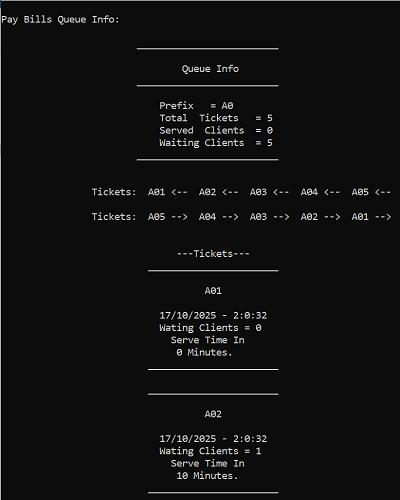

# Ticket Queue - C++

This project is a continuation of the previous repository:  
[**Implemented Data Structures - C++**](https://github.com/Shehab-Ghitany/implemented-data-structures-cpp).

---

## Overview

Simple queue project system implemented in C++ to model ticket lines (e.g., bill payments or subscriptions).

The main class `clsQueueLine` manages ticket issuance, waiting clients, and service order using both `std::queue` and `std::stack` containers to display tickets in multiple directions.  
An inner class `clsTicket` encapsulates ticket details such as prefix, number, issue time, and expected service duration.

---

## Features

* Create and manage multiple independent queue lines (e.g., bill payment, subscriptions).
* Automatically assign ticket numbers with time stamps.
* Display queue info, waiting and served clients.
* Print tickets in right-to-left or left-to-right order using queue and stack logic.

---

## Purpose

This mini project demonstrates how abstract data structures like **queues** and **stacks** can be integrated.  
It provides a small but practical example of applying OOP and STL containers in a ticket queue scenario.

Additionally, `clsDate` is used to generate and format the current date and time for each issued ticket,  
keeping the system modular and organized.

---

## Screenshots:

Queue Info & Tickets:

---

## Author

**Shihab Ghitany**
